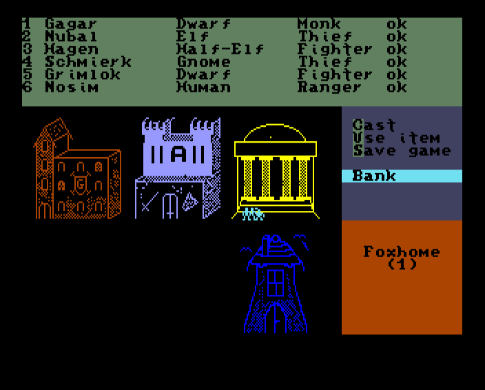

# DragonRock

A CRPG for the MEGA65 computer.



## Overview

DragonRock is an immersive fantasy role-playing game developed specifically for the MEGA65 computer. Taking inspiration from classic CRPGs of the 8-bit era, DragonRock offers adventurers a world filled with cities to explore, dungeons to conquer, and monsters to battle.


## Development Tools

DragonRock comes with custom development tools to create and extend the game world:

### tools/maped.py
A map editor for dungeon and outoors maps

### tools/mc
A map compiler.
The game content is scripted in a simple language called DRScript. The map compiler converts DRScript into bytecode which can be used in the game.

### tools/png2dbm.py
A PNG to DBM converter for displaying ingame graphics as super extended colour mode images

## System Requirements

- MEGA65 computer or compatible emulator
- Storage device for game data (SD card recommended)

## Building From Source

### Requirements

- CC65 Compiler Suite
- Python 3.6 or later
- Git

### Build Commands

```
# Compile the game only
scons
# or
scons compile

# Compile and build the disc image
scons build

# Clean all build artifacts
scons clean
```

### Directory Structure

- `src/` - Source code files
- `tools/` - Development and build tools
- `maps/` - Game maps and level data
- `graphics/` - Graphic resources
- `gamedata-src/` - Source files for game data

When building Dragon Rock, the artifacts are placed in the following folders:
- `obj/` - Compiled object files (created during build)
- `bin/` - Binary output files (created during build)
- `gamedata/` - Game resources and data files (created during build)
- `disc/` - Disc image files (created during build)

## Contributing

Contributions to DragonRock are welcome! Whether it's bug fixes, new features, or content additions, feel free to fork the repository and submit a pull request.

## License

TODO


## Acknowledgments

- Thanks to the MEGA65 team for creating an amazing platform
