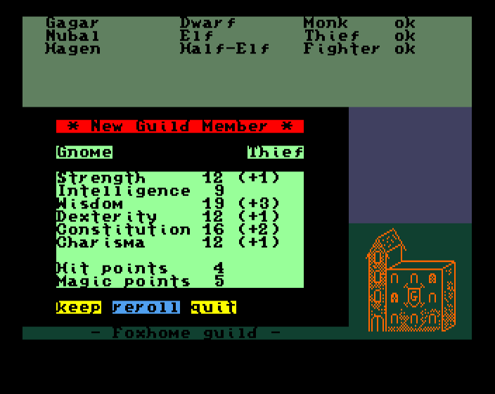
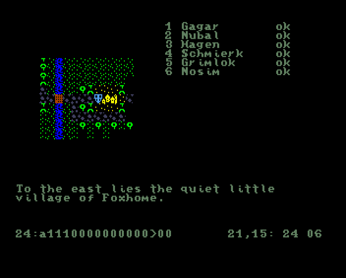

# DragonRock

A classic Computer Role-Playing Game (CRPG) for the MEGA65 computer.


## Overview

DragonRock is an immersive fantasy role-playing game developed specifically for the MEGA65 computer. Taking inspiration from classic CRPGs of the 8-bit era, DragonRock offers adventurers a world filled with cities to explore, dungeons to conquer, and monsters to battle.

## Features

- Create and develop your own party of adventurers
- Explore cities with shops, guilds, and inns
- Journey through the wilderness on the overworld map
- Delve into dangerous dungeons filled with traps, puzzles, and treasures
- Battle monsters in turn-based combat
- Find and equip various weapons, armor, and magical items
- Cast powerful spells to defeat your enemies

## Screenshots


*Character creation in the guild*


*Exploring the outdoor wilderness*


*Venturing through a dungeon*


*Character inventory and stats*

## Development Tools

DragonRock comes with custom development tools to create and extend the game world:


*The DragonRock map editor*


*Map compiler that translates map scripts into game bytecode*

## System Requirements

- MEGA65 computer or compatible emulator
- Storage device for game data (SD card recommended)

## Building From Source

### Requirements

- CC65 Compiler Suite
- SCons build system
- Python 3.6 or later
- Git

### Build Commands

```
# Compile the game only
scons
# or
scons compile

# Compile and build the disc image
scons build

# Clean all build artifacts
scons clean
```

### Directory Structure

- `src/` - Source code files
- `obj/` - Compiled object files (created during build)
- `bin/` - Binary output files
- `gamedata/` - Game resources and data files
- `disc/` - Disc image files
- `tools/` - Development and build tools
- `maps/` - Game maps and level data
- `graphics/` - Graphic resources
- `gamedata-src/` - Source files for game data

## Contributing

Contributions to DragonRock are welcome! Whether it's bug fixes, new features, or content additions, feel free to fork the repository and submit a pull request.

## License

[Insert license information here]

## Acknowledgments

- Thanks to the MEGA65 team for creating an amazing platform
- All contributors and testers who have helped shape the game
