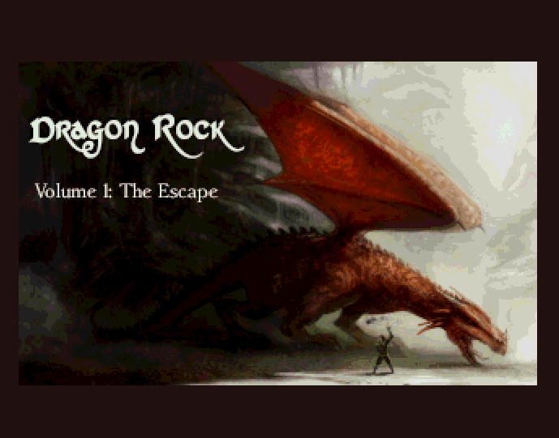
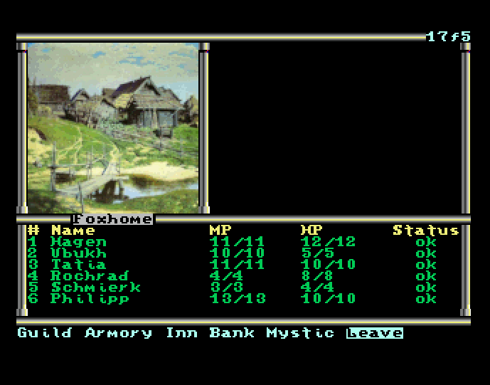
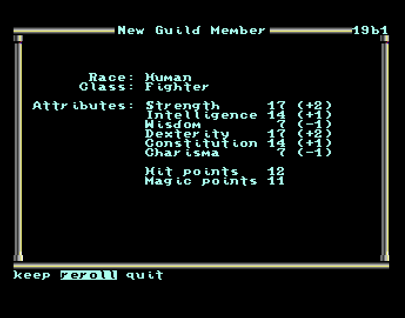
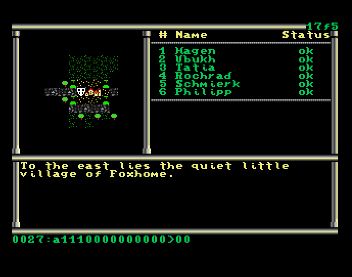
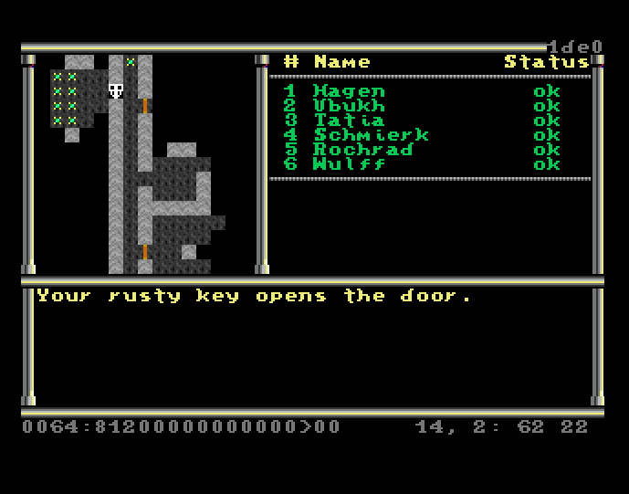
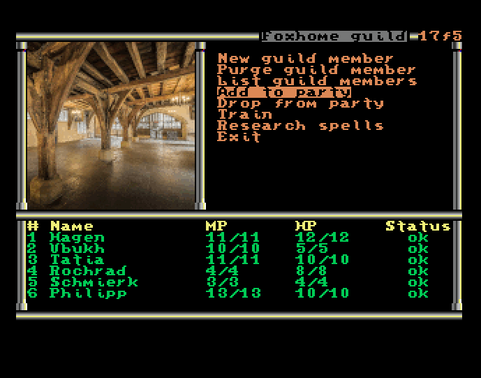
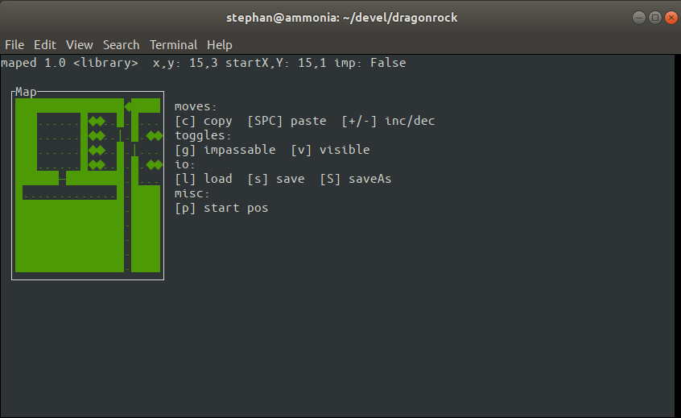
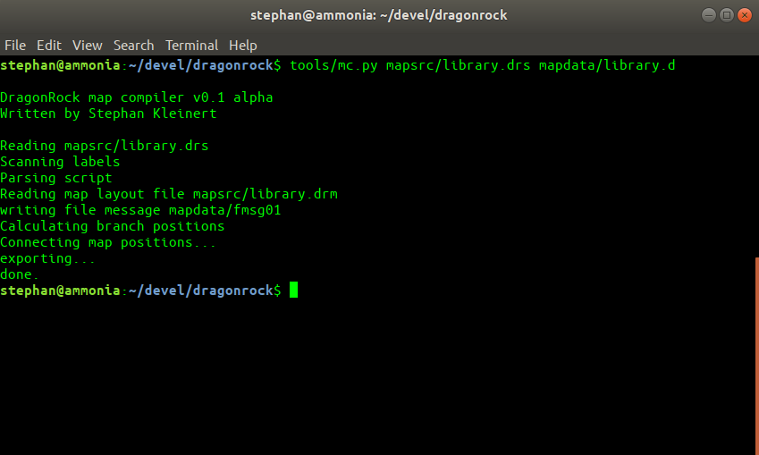

# DragonRock

A role playing game for the MEGA65.

I got the idea for "Dragon Rock" upon realizing that there are hardly any native role playing games for the Commodore TED series of computers (c16, c116, plus/4). Since I always had soft spot for the underdogs and also always wanted to implement a classic CRPG, I decided to fill this gap.

But once I had begun implementing DRs advanced features (such as a compiled dungeon description language and a bytecode interpreter along with it), I realized that the poor old TEDs would have a hard time processing all the stuff, and the project slowed down and finally was put on hold.

Then along came the amazing MEGA65 re-imagination of Commodore's last 8-bit-machine, and I knew, the platform to complete "Dragon Rock" was finally there (actually, some 20 years ago, I was the owner of one of the fabled C65 prototypes, there are even still some demos by yours truly floating around on the 'net, so developing for the MEGA65 felt like coming home to me... but that's a different story).

Gameplay-wise "Dragon Rock" is modelled after "Phantasie" (my favourite crpg series on 8-bit computers, because it's simple and challenging at the same time). It's still very much work in progress and contributions are of course welcome (oh well, who am I kidding ;-)).

"Dragon Rock" features 

- scripted, dynamic dungeons (dungeons are laid out in a map editor and an accompanying DungeonScript. The build tools then convert the map and the script into bytecode which the actual game uses)

- a map editor

- full colour graphics (at the moment for cities, special encounters and buildings)

- an easy to use menu system


Here's some screenshots of what's in there by now:

<br/>Loading screen

<br/>
Home, sweet home

<br/>
Creating a character

<br/>
Outdoor map view

<br/>
A dungeon

<br/>
Visiting the guild




Of course, "Dragon Rock" comes with its own map editor...



...and map compiler, which translates a 'DungeonScript' file into bytecode, which then
gets interpreted by the main binary on the MEGA65.

## Overview

## System Requirements

- MEGA65 computer or compatible emulator
- Storage device for game data (SD card recommended)


## Building From Source

### Requirements

- CC65 Compiler Suite, version 2.19 or later
- Python 3.6 or later
- Git
- c1541 from VICE (for building the disc image)
- LaTeX (for building the game manual)

### Setup

1. clone the project: 
```
git clone https://github.com/steph72/dragonrock-mega65.git
```

2. install the project submodules: 
```
git submodule update --init
```

3. setup the python environment & requirements. Don't worry – there's a script for that ;-) 
```
./setupPythonEnvironment.sh
```

4. activate the python environment
```
source dr_venv/bin/activate
```

That's it, you're ready to go!

### Building

DragonRock uses the scons build system because it is so very much nicer and more flexible than Makefiles. Scons is installed alongside with the python environment. 

#### Compile the game only:
```
# Compile the game only
scons
# or
scons compile

# Compile and build the disc image
scons build

# Clean all build artifacts
scons clean
```


## Development Tools

DragonRock comes with custom development tools to create and extend the game world. These are described in detail in the doc folder.

### tools/maped.py
A map editor for dungeon and outoors maps

### tools/mc
A map compiler.
The game content is scripted in a simple language called DRScript. The map compiler converts DRScript into bytecode which can be used in the game.

### tools/png2dbm.py
A PNG to DBM converter for displaying ingame graphics as super extended colour mode images


### Build Commands


### Directory Structure

- `src/` - Source code files
- `tools/` - Development and build tools
- `maps/` - Game maps and level data
- `graphics/` - Graphic resources
- `gamedata-src/` - Source files for game data

When building Dragon Rock, the artifacts are placed in the following folders:
- `obj/` - Compiled object files (created during build)
- `bin/` - Binary output files (created during build)
- `gamedata/` - Game resources and data files (created during build)
- `disc/` - Disc image files (created during build)

## Contributing

Contributions to DragonRock are welcome! Whether it's bug fixes, new features, or content additions, feel free to fork the repository and submit a pull request.


## Acknowledgments

- Thanks to the MEGA65 team for creating an amazing platform
