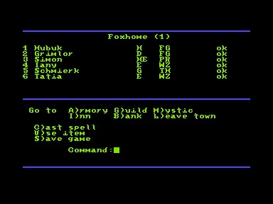
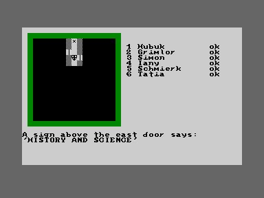
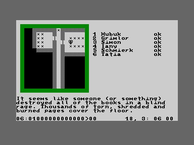

# dragonrock-ted
A role playing game for Commodore TED 64k computers

I got the idea for "Dragon Rock" upon realizing that there are hardly any native role playing
games for the Commodore TED series of computers (c16, c116, plus/4). Since I always had soft 
spot for the underdogs and also always wanted to implement a classic CRPG, I decided to fill this gap.

Gameplay-wise "Dragon Rock" is modelled after "Phantasie" (my favourite crpg series on 8-bit 
computers, because it's simple and challenging at the same time). It's still very much work
in progress and contributions are of course welcome (oh well, who am I kidding ;-)).

Here's some screenshots of what's in there by now:

Character creation in a guild

City main menu

Dungeon view

Character detail in the dungeon. Hubuk has collected the 'rusty key', which...

...opened this door ;-)

Of course, "Dragon Rock" comes with its own map editor...

...and map compiler, which translates a 'mapscript' file into bytecode, which then
gets interpreted by the main binary on the TED machine.

