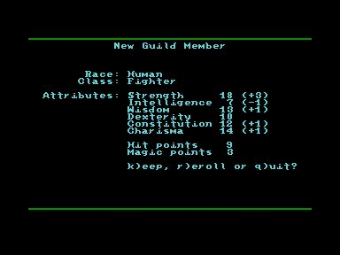

# dragonrock-ted
A role playing game for Commodore TED 64k computers

I got the idea for "Dragon Rock" upon realizing that there are hardly any native role playing
games for the Commodore TED series of computers (c16, c116, plus/4). Since I always wanted to
implement a classic CRPG, I decided to fill this gap.

Gameplay-wise "Dragon Rock" is modelled after "Phantasie" (my favourite crpg series on 8-bit 
computers, because it's simple and challenging at the same time). It's still very much work
in progress and contributions are of course welcome (oh well, who am I kidding ;-)).

Here's some screenshots of what's in there by now:

